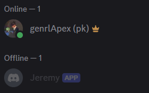
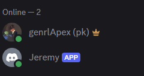
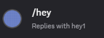

# Simple discord general purpose bot

## A simple discord bot for any server written in js

### Requirements: 
- I used <a href="https://nodejs.org/en">nodejs</a> as the js backend which i also recommend
- Use npm to install the <a href="https://discord.js.org/">discord.js</a> & <a href="https://www.npmjs.com/package/dotenv">dotenv</a>

### .env File:
- You will need to create a file with the main directory with
    - Your bot token
        - TOKEN
    - Your guild id
        - GUILD_ID
    - Your bot's client id
        - CLIENT_ID

### Use:
- index.js
    - index.js is the main file that you need to run for the bot to be active
    - Without this file running the bot will be offline
    - Visual guide:
        - While not running file 
            
        - While running file 
            

- register-commands.js
    - Run this file to register slash commands
    - Example
        -       {
                    name: "hey",
                    description: "Replies with hey!",
                },
    
        - 
    
    - You only need to run this once to register the commands
    - You can customise the name and description to match your command
    - When a command registry is successful it will print "Registered commands successfully!" to the console